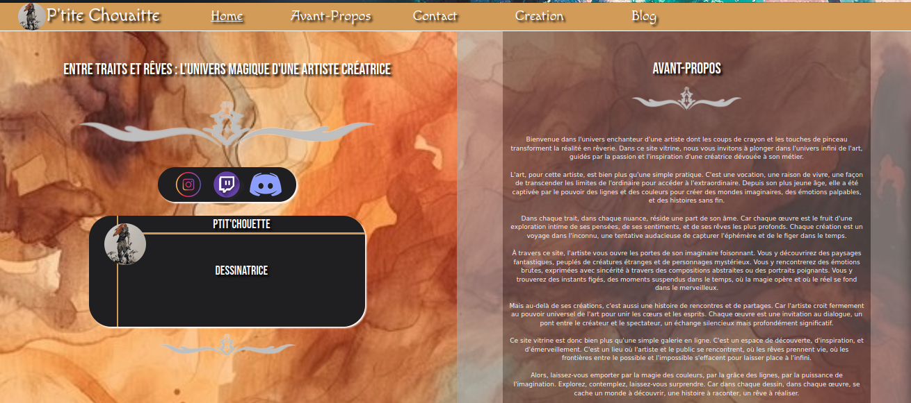

# Site Vitrine de P'tite Chouaitte

## Table des matiere

> 1/: __**Preview**__.

> 2/: __**Avant-Propos**__.

> 3/: __**Language**__.

> 4/: __**Framework**__.

> 5/: __**M.V.P**__

> 6/: __**Annexe**__

***

### 1/: Preview

***

**Index.html**

***

***

### 2/: avant Propos

Bienvenue dans l'univers enchanteur d'une artiste dont les coups de crayon et les touches de pinceau transforment la réalité en rêverie. Dans ce site vitrine, nous vous invitons à plonger dans l'univers infini de l'art, guidés par la passion et l'inspiration d'une créatrice dévouée à son métier.

L'art, pour cette artiste, est bien plus qu'une simple pratique. C'est une vocation, une raison de vivre, une façon de transcender les limites de l'ordinaire pour accéder à l'extraordinaire. Depuis son plus jeune âge, elle a été captivée par le pouvoir des lignes et des couleurs pour créer des mondes imaginaires, des émotions palpables, et des histoires sans fin.

Dans chaque trait, dans chaque nuance, réside une part de son âme. Car chaque œuvre est le fruit d'une exploration intime de ses pensées, de ses sentiments, et de ses rêves les plus profonds. Chaque création est un voyage dans l'inconnu, une tentative audacieuse de capturer l'éphémère et de le figer dans le temps.

À travers ce site, l'artiste vous ouvre les portes de son imaginaire foisonnant. Vous y découvrirez des paysages fantastiques, peuplés de créatures étranges et de personnages mystérieux. Vous y rencontrerez des émotions brutes, exprimées avec sincérité à travers des compositions abstraites ou des portraits poignants. Vous y trouverez des instants figés, des moments suspendus dans le temps, où la magie opère et où le réel se fond dans le merveilleux.

Mais au-delà de ses créations, c'est aussi une histoire de rencontres et de partages. Car l'artiste croit fermement au pouvoir universel de l'art pour unir les cœurs et les esprits. Chaque œuvre est une invitation au dialogue, un pont entre le créateur et le spectateur, un échange silencieux mais profondément significatif.

Ce site vitrine est donc bien plus qu'une simple galerie en ligne. C'est un espace de découverte, d'inspiration, et d'émerveillement. C'est un lieu où l'artiste et le public se rencontrent, où les rêves prennent vie, où les frontières entre le possible et l'impossible s'effacent pour laisser place à l'infini.

Alors, laissez-vous emporter par la magie des couleurs, par la grâce des lignes, par la puissance de l'imagination. Explorez, contemplez, laissez-vous surprendre. Car dans chaque dessin, dans chaque œuvre, se cache un monde à découvrir, une histoire à raconter, un rêve à réaliser.

***